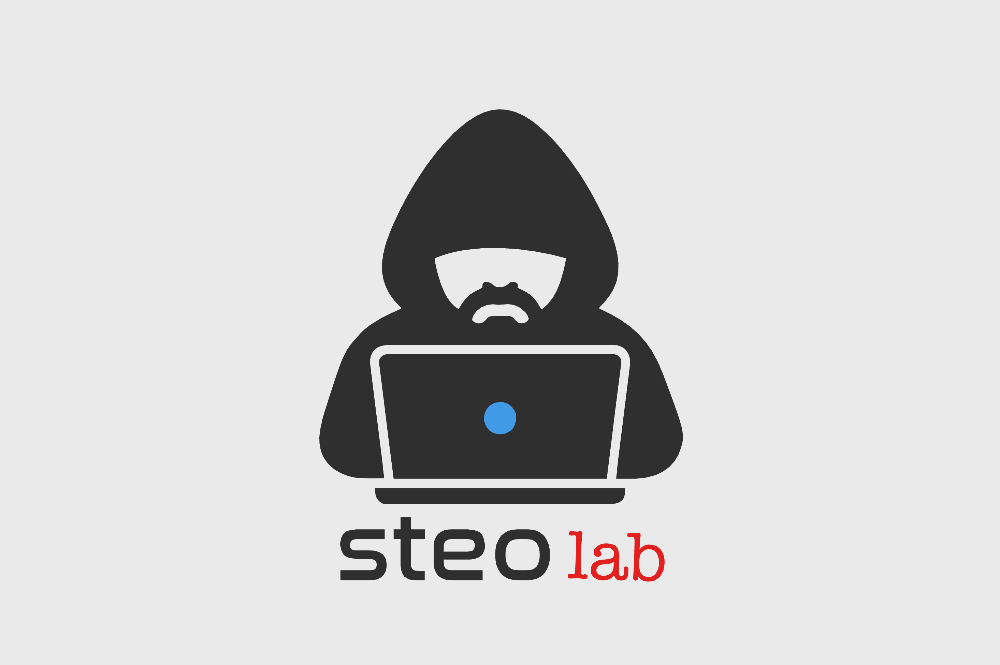

# steolab - Embedded & IoT Solutions

Sito web professionale per **steolab**, specializzato in sviluppo embedded, soluzioni IoT e tool di recovery hardware.



## Caratteristiche

- Sito web moderno e responsive
- Design professionale con brand identity (rosso, nero, blu)
- Portfolio progetti con link a GitHub
- Sezione servizi dettagliata
- Form contatti funzionante
- Ottimizzato per SEO e performance
- Pronto per hosting Aruba

## Servizi Offerti

### Sviluppo Embedded
Firmware e software embedded in C/C++ per microcontrollori e sistemi embedded. Esperienza con schede LILYGO e moduli cellulari.

### Soluzioni IoT
Progettazione e implementazione di sistemi IoT con connettività cellulare. Configurazione modem SIM7000G per reti europee e italiane.

### Tool di Recovery
Sviluppo di tool automatici per il recovery e la configurazione di dispositivi hardware. Soluzioni one-click.

### Consulenza Tecnica
Supporto tecnico specializzato per progetti embedded e IoT. Analisi requisiti, scelta componenti e troubleshooting.

## Competenze Tecniche

**Linguaggi:** C/C++, Python, JavaScript, Assembly
**Hardware:** LILYGO, ESP32/ESP8266, Arduino, Modem SIM7000G
**Protocolli:** MQTT, HTTP/HTTPS, CoAP, Serial (UART/I2C/SPI)
**Tool:** Arduino IDE, PlatformIO, Git/GitHub, VS Code

## Progetti in Evidenza

### LILYGO SIM7000G Recovery Tool
Tool automatico di recovery per schede LILYGO T-SIM7000G con modem non responsivi. Configurazione one-click per reti EU/Italia.

- [GitHub Repository](https://github.com/playloud679/LILYGO_SIM7000G_Recovery_Tool)
- Recovery automatico con un click
- Configurazione pre-impostata per EU/Italia
- Interfaccia user-friendly
- Diagnostica integrata

## Struttura del Progetto

```
steolab/
├── index.html          # Homepage principale
├── css/
│   └── style.css      # Stili custom con brand colors
├── js/
│   └── main.js        # JavaScript per interattività
├── img/
│   └── logo.png       # Logo steolab
├── .htaccess          # Configurazione Apache per Aruba
├── README.md          # Questo file
└── GUIDA_FILE_MANAGER_ARUBA.md  # Guida caricamento
```

## Tecnologie Utilizzate

- **HTML5** - Struttura semantica
- **CSS3** - Design moderno con variabili CSS e animazioni
- **JavaScript (ES6+)** - Interattività e UX
- **Responsive Design** - Mobile-first approach
- **SEO Optimized** - Meta tags e struttura ottimizzata

## Come Caricare il Sito su Aruba

### Metodo 1: File Manager Web (Raccomandato)

**📖 Per una guida completa passo-passo, leggi [GUIDA_FILE_MANAGER_ARUBA.md](GUIDA_FILE_MANAGER_ARUBA.md)**

Procedura rapida:

1. Accedi al pannello Aruba su https://www.aruba.it
2. Vai su "File Manager" nel menu
3. Naviga nella cartella `/www` o `/public_html`
4. Carica `index.html` nella root
5. Crea le cartelle `css`, `js`, `img`
6. Carica i file nelle rispettive cartelle
7. Carica `.htaccess` nella root
8. Verifica il sito su `http://tuodominio.it`

### Metodo 2: FTP (Per utenti avanzati)

1. Scarica FileZilla: https://filezilla-project.org/
2. Connetti con le credenziali FTP dal pannello Aruba
3. Carica tutti i file nella cartella principale
4. Verifica il sito

## Personalizzazione

### Modificare i Colori del Brand

Apri `css/style.css` e modifica le variabili CSS (righe 14-20):

```css
:root {
    --color-primary: #dc2626;        /* Rosso */
    --color-secondary: #3b82f6;      /* Blu */
    --color-dark: #1a1a1a;           /* Nero */
    /* ... */
}
```

### Modificare i Contenuti

- **Testi:** Modifica `index.html`
- **Servizi:** Sezione "Servizi Offerti" in `index.html`
- **Progetti:** Sezione "Progetti in Evidenza" in `index.html`
- **Contatti:** Sezione "Contatti" in `index.html`

### Aggiungere Nuovi Progetti

Duplica la struttura `.project-card` in `index.html` (righe 134-162) e modifica:

```html
<div class="project-card">
    <div class="project-header">
        <h3>Nome Progetto</h3>
        <a href="LINK_GITHUB" target="_blank" class="project-link">
            <!-- GitHub icon -->
        </a>
    </div>
    <p class="project-description">
        Descrizione progetto...
    </p>
    <div class="project-tags">
        <span class="tag">Tag1</span>
        <span class="tag">Tag2</span>
    </div>
    <!-- ... -->
</div>
```

### Modificare Email di Contatto

In `index.html` (riga 271), modifica:

```html
<a href="mailto:TUA-EMAIL@dominio.it">TUA-EMAIL@dominio.it</a>
```

## Configurazione SSL/HTTPS

Se hai un certificato SSL su Aruba:

1. Apri `.htaccess`
2. Rimuovi i commenti (`#`) dalle righe 6-7:
   ```apache
   RewriteCond %{HTTPS} off
   RewriteRule ^(.*)$ https://%{HTTP_HOST}%{REQUEST_URI} [L,R=301]
   ```
3. Salva e ricarica su Aruba

## SEO e Performance

Il sito include:

- ✅ Meta tags ottimizzati
- ✅ Semantic HTML5
- ✅ Compressione GZIP (via .htaccess)
- ✅ Cache browser configurata
- ✅ Immagini ottimizzate
- ✅ Lazy loading per animazioni
- ✅ Mobile-first responsive design

## Browser Supportati

- Chrome/Edge (ultimi 2 versioni)
- Firefox (ultimi 2 versioni)
- Safari (ultimi 2 versioni)
- Mobile browsers (iOS Safari, Chrome Mobile)

## Risoluzione Problemi

### Il logo non si vede

Verifica che `img/logo.png` sia presente e che il percorso in `index.html` sia corretto.

### Il menu mobile non funziona

Controlla che `js/main.js` sia caricato correttamente e che non ci siano errori nella console (F12).

### Gli stili non vengono applicati

1. Verifica che `css/style.css` sia presente
2. Svuota la cache del browser (Ctrl+F5)
3. Controlla il percorso in `index.html` (riga 9)

### Form contatti non funziona

Il form è configurato per mostrare solo una notifica. Per un form funzionante:

1. Crea un endpoint PHP sul server
2. Modifica `js/main.js` (riga 95) per inviare i dati al server
3. Oppure usa servizi come Formspree, EmailJS, ecc.

## Contatti

- **GitHub:** [github.com/playloud679](https://github.com/playloud679)
- **Email:** info@steolab.it
- **Ubicazione:** Italia

## Licenza

© 2024 steolab. Tutti i diritti riservati.

Questo sito è proprietà di steolab e può essere utilizzato liberamente per scopi personali e commerciali della propria attività.

## Sviluppo Futuro

Possibili miglioramenti:

- [ ] Aggiungere sezione blog/articoli tecnici
- [ ] Integrare form contatti con backend
- [ ] Aggiungere più progetti al portfolio
- [ ] Implementare versione multilingua (IT/EN)
- [ ] Aggiungere sezione testimonial/recensioni
- [ ] Creare area download per tool e documentazione

## Credits

- Design & Development: steolab
- Icons: SVG inline custom
- Fonts: System fonts
- Hosting: Aruba

---

**Built with ❤️ for embedded systems**
